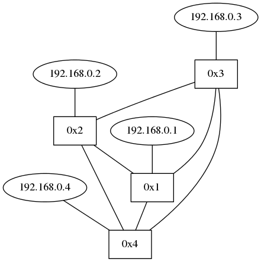
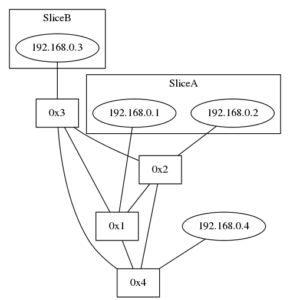
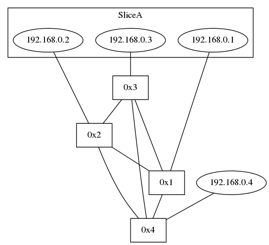
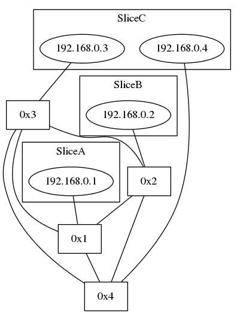

# レポート課題

> 1. スライスの分割・結合  
> スライスの分割と結合機能を追加する  
> 2. スライスの可視化  
> Graphvizでスライスの状態を表示

## 役割分担
* Sliceコマンド関連：@yamatchan, @k-nakahr
* Graphviz関連：@s-kojima, @sunya-ch
* レポート執筆：@yamatchan, @s-kojima
* ソーラン節：@s-sigaki

## コードの解説
(*^◯^*)

## 動作確認
オリジナルの`trema.conf`を用いて，動作確認を行った，  
まず，全てのホストとスイッチのトポロジ画像を生成するために，以下のコマンドを実行した．

```
$ bin/trema run lib/routing_switch.rb -c trema.conf -- -s
$ bin/trema send_packet -s host1 -d host2
$ bin/trema send_packet -s host2 -d host1
$ bin/trema send_packet -s host3 -d host1
$ bin/trema send_packet -s host4 -d host1
```

上記コマンド実行後に出力されたトポロジ画像を以下に示す．  


### スライス可視化機能
次に，スライスの可視化機能を確認するために，host1およびhost2をSliceAに追加した．  
入力コマンドおよびコマンド実行後のトポロジ画像を以下に示す．  
ちゃんとできとるわ．  

```
$ bin/slice add SliceA
$ bin/slice add_host -s SliceA --mac 11:11:11:11:11:11 --port 0x1:1
$ bin/slice add_host -s SliceA --mac 22:22:22:22:22:22 --port 0x2:1
$ bin/slice add_host -s SliceB --mac 33:33:33:33:33:33 --port 0x3:1
```




### スライス結合機能
次に，スライスの結合機能の動作確認を行うために，SliceBをSliceAに結合する処理を行った．

まず，スライス結合機能の仕様を説明する．  
以下のコマンドを実行すると，sオプションに指定したスライスにintoオプションに指定したスライス(複数可)を結合する．  
なお，sオプションに指定したスライスが存在しない場合は，新たにスライスを作成し，intoオプションのスライスを結合する． 
また，結合されたスライスは削除される．

```
$ bin/slice join -s <slice-name> --into <slice-name>{,<slice-name>}
``` 
  
入力コマンドおよびコマンド実行後のトポロジ画像を以下に示す．  
画像かくにん！ よかった．(小保方風に)  

```
$ bin/slice join -s SliceA --into SliceB
$ bin/slice list
SliceA
  0x1:1
    11:11:11:11:11:11
  0x2:1
    22:22:22:22:22:22
  0x3:1
    33:33:33:33:33:33
```




### スライス分割機能
次に，スライスの分割機能の動作確認を行うために，host4をSliceAに追加した後に，SliceBをSliceAに結合する処理を行った．
sオプションに指定したスライドをintoオプションに指定した通りに分割を行う．  
なお，分割に指定されなかったホストは，そのままsオプションのスライスに残すようにした．  
動作確認にあたり入力コマンドおよびコマンド実行後のトポロジ画像を以下に示す．  
おっけー  

```
$ bin/slice add_host -s SliceA --mac 44:44:44:44:44:44 --port 0x4:1
$ bin/slice split -s SliceA --into "SliceB:host2 SliceC:host3,host4"
$ bin/slice list
SliceA
  0x1:1
    11:11:11:11:11:11
SliceB
  0x2:1
    22:22:22:22:22:22
SliceC
  0x3:1
    33:33:33:33:33:33
  0x4:1
    44:44:44:44:44:44
```




終わりなんだ(*^◯^*)
